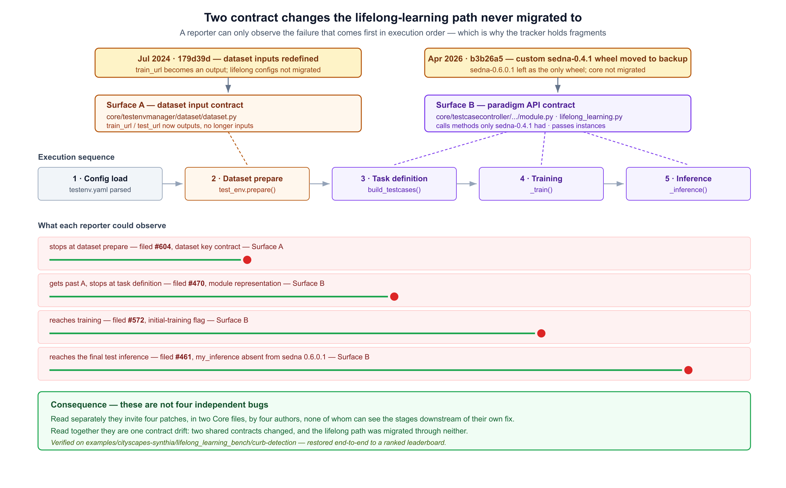
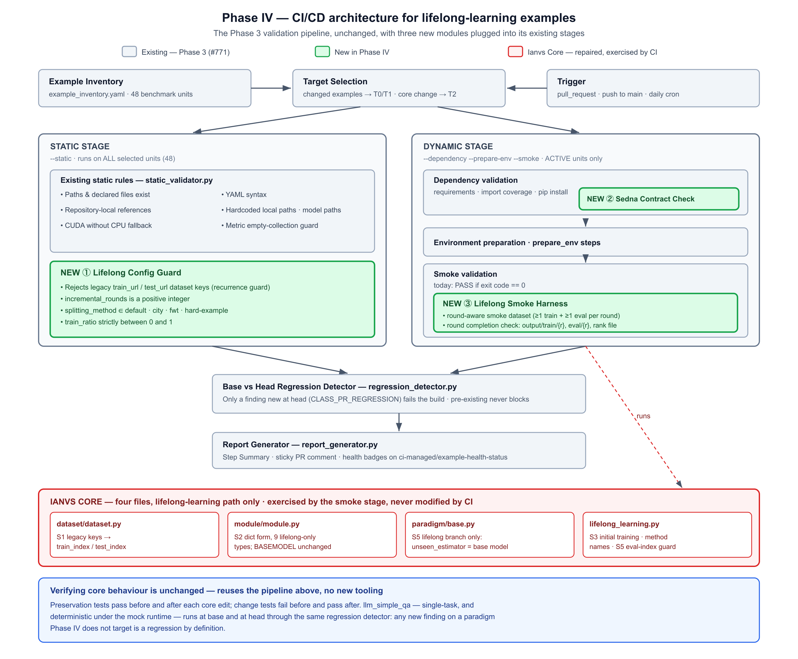
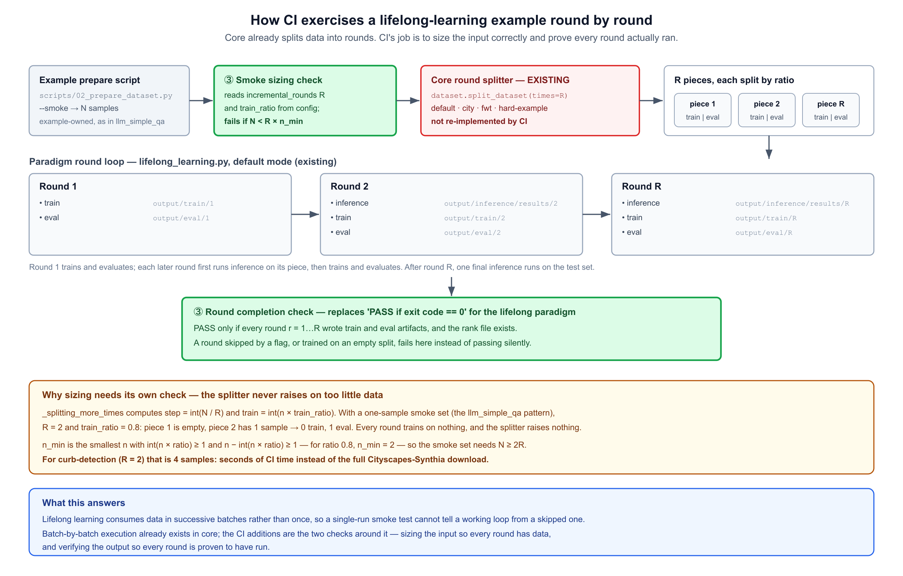
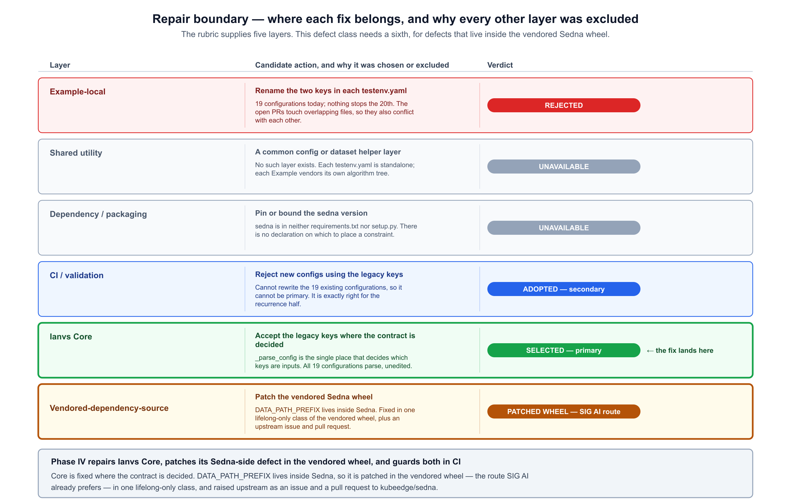
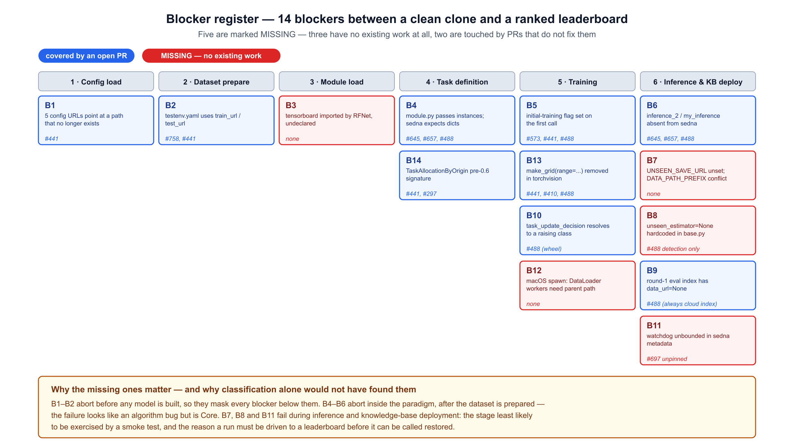
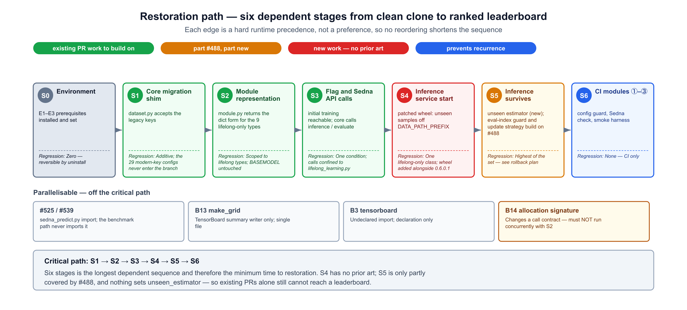

# KubeEdge Ianvs Example Restoration — Phase IV

**LFX Mentorship 2026 Term 3 · CNCF / KubeEdge**
Author: Suhaan ([@suhaan-24](https://github.com/suhaan-24))
Project: CNCF - KubeEdge: Comprehensive Example Restoration for Ianvs: Phase IV · umbrella issue [#230](https://github.com/kubeedge/ianvs/issues/230)

---

## Cited targets — state verified 2026-09-21

| Target | State | Role in this proposal |
|---|---|---|
| [#604](https://github.com/kubeedge/ianvs/issues/604) | **closed** (completed, 2026-08-27) | Surface A — dataset input contract. Closed, but the behaviour persists at `main`; see Problem Statement. |
| [#470](https://github.com/kubeedge/ianvs/issues/470) | open | Surface B — `module.py` passes instances where sedna resolves dicts |
| [#461](https://github.com/kubeedge/ianvs/issues/461) | open | Surface B — `my_inference` absent from sedna 0.6.0.1 |
| [#572](https://github.com/kubeedge/ianvs/issues/572) | open | Surface B — initial-training flag set on the first call |
| [#743](https://github.com/kubeedge/ianvs/issues/743) | open | CI check for broken example config paths — the recurrence guard relates to this |
| [#758](https://github.com/kubeedge/ianvs/pull/758) | open PR | Warn on deprecated dataset fields — the alternative to the Core shim |
| [#488](https://github.com/kubeedge/ianvs/pull/488) | open PR | Phase 2 mentee's restoration of the sibling example — core fixes for B5 and B9, and a patched `sedna-0.6.0.2` wheel covering B4, B6 and B10 from the Sedna side |
| [#645](https://github.com/kubeedge/ianvs/pull/645) | open PR | Sedna API mismatches and module objects |
| [#697](https://github.com/kubeedge/ianvs/pull/697) | open PR | Restores the curb-detection benchmark at the example layer |

Code state verified against `upstream/main` at commit `14670a4` (2026-09-10); the four core files and the validator are unchanged since `95016db`.

---

## Background

Ianvs ships benchmarking examples across edge AI, cloud-edge collaboration, federated and lifelong
learning, LLM benchmarking and robotics. Three prior mentorship phases have worked on keeping them
runnable:

| Phase | Term | What it delivered |
|---|---|---|
| [Phase 1](../phase-1-2025-term-3/example-restoration.md) ([#263](https://github.com/kubeedge/ianvs/pull/263)) | 2025 T3 | Restoration direction, methodology and roadmap |
| [Phase 2](../phase-2-2026-term-1/Example_Restoration.md) ([#375](https://github.com/kubeedge/ianvs/pull/375)) | 2026 T1 | Concrete repair plan for named broken examples |
| [Phase 3](../phase-3-2026-term-2/proposal.md) ([#541](https://github.com/kubeedge/ianvs/pull/541)) | 2026 T2 | Example Classification CI Validation Framework |

Phase 3 built the machinery — an inventory, tiered validation, regression-aware pull-request
comparison and published health reporting — and drove exactly one example through it end to end.
The inventory records the result plainly:

| Status | Benchmark units |
|---|---|
| `active` | 1 (`simple_qa_singletask_learning`) |
| `onGoing` | 1 (`execution_yaml_pending`) |
| `unvalidated` | **46** |

Phase 3's own acceptance criteria 14 and 15 place broad repair out of scope and require that
"failures requiring repair outside `examples/llm_simple_qa` are recorded for separate follow-up
issues or proposals."

**Phase IV is that follow-up.** It takes one of the largest unvalidated groups — the
lifelong-learning family — establishes why it fails, repairs it in the layer where the defect
actually lives, and adds the CI checks that stop the same break recurring.

---

## Goals

1. Identify the root cause behind the lifelong-learning example failures, rather than treating the
   open issues as independent defects.
2. Restore `examples/cityscapes-synthia/lifelong_learning_bench/curb-detection` from a clean clone
   to a ranked leaderboard.
3. Place each repair in the layer where the defect is decided, with the boundary decision
   justified and every rejected layer recorded.
4. Extend the Phase 3 validator so the contract that broke becomes observable in CI instead of only
   in a contributor's traceback.
5. Prevent recurrence: make it impossible to merge a new configuration written against the broken
   contract.
6. Record honestly what is repaired, what is worked around, and what must go upstream — so a
   workaround is never closed as a fix.

---

## Problem Statement

### 1. The open issues look independent, and are being fixed that way

Four open issues describe the lifelong-learning failure:

| Issue | Reported symptom |
|---|---|
| [#604](https://github.com/kubeedge/ianvs/issues/604) | `train_url`/`test_url` in `testenv.yaml` are not read by core — *closed as completed 2026-08-27, but see below* |
| [#470](https://github.com/kubeedge/ianvs/issues/470) | `module.py` passes instances where sedna expects dicts |
| [#461](https://github.com/kubeedge/ianvs/issues/461) | `my_inference` does not exist in sedna 0.6.0.1 |
| [#572](https://github.com/kubeedge/ianvs/issues/572) | `HAS_COMPLETED_INITIAL_TRAINING` set wrongly on the first call |

Several open pull requests address them, mostly by editing example directories. Read separately, they
invite separate patches in two Core files by different authors, none of whom can see the stages
downstream of their own fix.

**#604 is closed, and the behaviour it describes is still present.** It was closed as *completed* on
2026-08-27. Verified against `origin/main` at commit `95016db` (2026-08-27):
`_parse_config` still assigns only attributes already present in `__dict__`, and `_check_fields`
still raises `NotImplementedError('not one of train_index/train_data/train_data_info')`. The pull
request that would have warned on the deprecated fields,
[#758](https://github.com/kubeedge/ianvs/pull/758), remains open and unmerged. Nineteen example
configurations still declare `train_url`/`test_url` with no modern key alongside — none declares
both. The issue is closed; the defect is not.

### 2. They are one contract drift, refracted

Ianvs changed two contracts that the lifelong-learning path depends on, and migrated that path
through neither. Both changes are in this repository's own history:

- **Surface A — dataset input contract.** Before commit `179d39d` (6 Jul 2024, the LLM-benchmarks
  work), `core/testenvmanager/dataset/dataset.py` read `train_url` / `test_url` as its *inputs*
  (`self.train_url = self._process_index_file(self.train_url)`). That commit redefined them as
  *outputs* computed from new inputs, `train_index` / `train_data` / `train_data_info`; a
  configuration supplying only `train_url` now raises `NotImplementedError`. All 12 `testenv*.yaml`
  files under `lifelong_learning_bench` still declare the old keys.
- **Surface B — paradigm API contract.** The lifelong paradigm in `core/` was developed alongside
  Ianvs's own customised `sedna-0.4.1` wheel — commits `2082e2d` and `a74a843` (Mar 2023) change
  `lifelong_learning.py` and add the 0.4.x wheels together. It calls three methods that exist in that
  wheel and nowhere else:

  | Method core calls | `sedna-0.4.1` | `sedna-0.4.5` | `sedna-0.6.0.1` |
  |---|---|---|---|
  | `inference_2` | yes | no | no |
  | `my_inference` | yes | no | no |
  | `my_evaluate` | yes | no | no |

  On 22 Apr 2026, commit `b3b26a5` consolidated `examples/resources/` into `resources/` and moved the
  0.4.x wheels to `resources/third_party-bk/`, leaving `sedna-0.6.0.1` — added in 2024 for the
  joint-inference example — as the only vendored wheel. The methods core relies on disappeared with
  it. `core/testcasecontroller/algorithm/module/module.py` also hands Sedna live instances where
  `sedna-0.6.0.1` resolves `{"method": ..., "param": ...}` dicts. #461 and #470 were filed within five
  weeks of that commit.

These are not Sedna breaking its API: the three missing methods were never in upstream Sedna. They
are Ianvs changing shared contracts for other paradigms' benefit, without migrating the lifelong
path.

Because execution is sequential, a reporter can only ever observe the failure that comes **first**.
That is precisely why the tracker holds fragments rather than one issue.



### 3. Nothing prevents the next occurrence

Core silently discards unknown configuration keys. Renaming the keys in the nineteen affected
configurations repairs them once and does nothing about the twentieth, written later against the old
contract. There is no check anywhere in the repository that would notice.

### 4. The CI framework cannot currently see any of this

Phase 3's validator is inventory-driven and thorough, but the string `sedna` appears exactly **once**
in its entire source — in `dependency_validator.py:58`, inside `PROJECT_PROVIDED_IMPORTS`, a
suppression set whose purpose is to stop `import sedna` being flagged as an undeclared dependency.
The framework therefore assumes Sedna is present and correct, and has no check that could observe a
version or contract mismatch.

---

## Proposal

Phase IV restores one example completely and closes the contract loop behind it:

1. **Migrate the contract in Core.** Accept the legacy dataset keys in
   `core/testenvmanager/dataset/dataset.py`, where the decision about which keys are inputs is made.
   This repairs the dataset contract for every affected configuration at once, without editing any of them.
2. **Repair the paradigm surface.** Correct the module representation, the initial-training flag,
   and the stale Sedna method names in the lifelong-learning paradigm.
3. **Carry the run to a leaderboard.** Resolve the inference and knowledge-base blockers that no
   open pull request currently addresses — the stages a smoke test never reaches.
4. **Extend the Phase 3 validator** with three modules — a Lifelong Config Guard, a Sedna Contract
   Check and a Lifelong Smoke Harness — that make the contract observable, prove every lifelong round
   runs, and reject new configurations written against the broken contract.
5. **Fix the Sedna-side defect the SIG AI way.** Patch defects that live inside Sedna in
   the vendored wheel — `DATA_PATH_PREFIX` by Phase IV, `UpdateStrategyDefault` via #488 — and raise it upstream as an issue and a pull request.

---

## Scope

### In scope

- `examples/cityscapes-synthia/lifelong_learning_bench/curb-detection`, restored from a clean clone
  to a ranked leaderboard.
- `core/testenvmanager/dataset/dataset.py` — the dataset input contract.
- `core/testcasecontroller/algorithm/module/module.py` and
  `core/testcasecontroller/algorithm/paradigm/lifelong_learning/lifelong_learning.py` — the paradigm
  API contract.
- Four new checks in `.github/workflows/validator/`, plus the inventory entry updates they require.
- Documentation of the environment prerequisites the restored run depends on.
- A patched vendored Sedna wheel carrying the `DATA_PATH_PREFIX` fix, documented in
  `resources/third_party/README.md`, and an upstream issue and pull request to `kubeedge/sedna`.

### Out of scope

- **Adding Ianvs-specific methods to Sedna.** Core is moved onto the API Sedna publishes rather
  than the wheel being extended to match core. See *Position on the Sedna wheel*.
- **Adopting a newer upstream Sedna release.** Phase IV patches the currently vendored wheel, per
  SIG AI's standing preference.
- **The other 45 unvalidated benchmark units.** Phase IV establishes the pattern and the guard;
  applying them across the fleet is follow-on work, and is listed under Future Work.
- **Restoring examples whose datasets are not publicly resolvable.** `mdil-ss` has no resolvable
  public direct link and BDD100K is Baidu-Pan gated; both are recorded as blocked rather than
  attempted.
- **Rewriting the open pull requests that address these issues.** Phase IV's Core migration is designed so they can land
  independently, whenever convenient.

---

## Target Users

### Ianvs maintainers

Today a maintainer reviewing any of the open pull requests on these issues has to decide, per pull request,
whether an example-level rename is the right fix — without a stated position on where the contract
belongs. After Phase IV the boundary is documented, the Core migration makes the renames optional
rather than urgent, and CI answers the recurrence question automatically.

### Contributors

A contributor who clones Ianvs and runs a lifelong-learning example currently hits a failure whose
traceback points at an algorithm file, when the cause is a Core contract. After Phase IV the
example runs; if it does not, the validator names the contract mismatch directly.

### Developers and enterprise users evaluating Ianvs

The lifelong-learning examples are the demonstration of Ianvs's distinguishing capability. An
evaluator who cannot run one has no way to assess the framework. Phase IV makes at least one of them
reproducible from a clean checkout, with the environment prerequisites written down.

---

## Design Details

This section is written top-down: the architecture first, then each new module and why lifelong
learning needs it, then where every change lands in the repository, then how core behaviour is
shown to be unchanged. Stage-by-stage implementation detail is in
[Appendix A](#appendix-a--ci-integration-detail).

### Architecture overview



Phase IV does not add a new pipeline. The Phase 3 validation framework
([#771](https://github.com/kubeedge/ianvs/pull/771)) stays exactly as it is — inventory, target
selection, a static stage, a dynamic stage, base-versus-head regression detection, and reporting.
Phase IV adds **three modules into the stages that already exist**, and repairs four files in
Ianvs Core that the dynamic stage exercises.

| Module | Stage | Runs on | Closes |
|---|---|---|---|
| ① Lifelong Config Guard | Static | every selected unit (48) | broken lifelong configuration reaching `main` |
| ② Sedna Contract Check | Dynamic | `active` units | the Sedna dependency being invisible to CI |
| ③ Lifelong Smoke Harness | Dynamic | `active` units | a lifelong run "passing" without every round running |

The stage each module sits in is decided by one rule, which the framework already applies: **a
check is dynamic if it needs a prepared environment, static otherwise.** Static checks receive
every selected unit; dynamic checks receive only `active` ones. The detail of that rule is in
Appendix A.

### User flow

Two people use this: a **contributor** changing a lifelong-learning example or the core code it
runs on, and a **maintainer** reviewing that change. Neither needs to learn a new tool — the three
modules run inside the commands and workflows Phase 3 already provides.

**Contributor**

1. **Before pushing, run it locally.** From the repository root:
   `python .github/workflows/validator/validation_runner.py --static --example <path>` runs module ①
   in seconds with nothing installed. Adding `--dependency --pip-install --prepare-env --smoke`
   runs modules ② and ③ in a disposable environment. The steps are the ones already documented in
   `docs/example_validator/local_validation.md`.
2. **Open the pull request.** The static workflow runs automatically on every selected unit; the
   dynamic workflow runs on `active` ones. For a first-time contributor, GitHub holds both until a
   maintainer approves the run.
3. **Read the result in the pull request.** One sticky comment, updated in place on every push,
   classifies each finding: *PR regression* (blocks), *pre-existing* (does not), or *fixed*. For a
   lifelong example it names what went wrong — a legacy dataset key and the file and line; the wrong
   Sedna installed; a smoke dataset too small for its rounds; or the round that did not finish.
4. **Fix and push again.** The same comment updates. A finding the pull request did not introduce
   never blocks it.

**Maintainer**

1. **Approve the workflow run** for first-time contributors.
2. **Review from the sticky comment.** Only *PR regression* blocks the merge, so a contributor who
   touched a file with the 19 pre-existing legacy keys is not held responsible for them.
3. **After merge**, the push to `main` triggers the Tier 3 sweep, and the health badge for
   curb-detection in `examples/README.md` updates from the published snapshot.
4. **Adjust coverage** by changing an inventory entry's `status` — moving a unit to `active` brings
   it under modules ② and ③.

### Module ① — Lifelong Config Guard

**What it checks**, on every `testenv*.yaml` and algorithm configuration of a selected unit:

| Rule | Level |
|---|---|
| No dataset declares the legacy `train_url` / `test_url` keys | `ERROR` |
| `incremental_rounds` is a positive integer | `ERROR` |
| `splitting_method` is one of `default`, `city_splitting`, `fwt_splitting`, `hard-example_splitting` | `ERROR` |
| `train_ratio` lies strictly between 0 and 1 | `ERROR` |

**Where it lives.** New rule functions in `static_validator.py`, registered in `validate_example()`
beside the existing path, YAML and portability rules. No new CLI flag; it rides `--static`.

**Why lifelong learning needs it.** These fields only take effect once the round loop starts, so
every mistake in them surfaces late, if ever:

- 19 of the 48 `testenv*.yaml` files still declare the legacy keys, **12 of them in
  `lifelong_learning_bench`**. Core discards unknown keys silently, so nothing stops a twentieth.
- An unknown `splitting_method` raises `ValueError` inside `dataset.split_dataset()` — but only at
  runtime, after the dataset has been prepared.
- **46 of 48 units are `unvalidated`, so they never reach runtime in CI at all.** For them, a static
  check is the only place a broken configuration can ever be caught.

It is the recurrence guard for the contract this proposal repairs, and it must be static for that
reason: the configuration it needs to reject will be written against an example nobody has
validated yet.

### Module ② — Sedna Contract Check

**What it checks**, in order, after dependencies are installed:

1. The vendored wheel exists in `resources/third_party/`.
2. The installed `sedna` distribution is the vendored version the example's `prepare_env` installs. This catches the PyPI name collision
   ([#489](https://github.com/kubeedge/ianvs/issues/489)), where `pip install sedna` silently
   installs an unrelated 0.1.2 package.
3. Every Sedna symbol that Ianvs Core calls resolves on the installed package — the classes and
   methods the lifelong paradigm hands control to.

**Where it lives.** A new `services/sedna_contract.py`, called from `dependency_validator.py` once
the install mode has resolved. It rides `--dependency`.

**Why lifelong learning needs it.** The lifelong paradigm is the one that hands control to Sedna:
`paradigm/base.py` constructs Sedna's `LifelongLearning` from the module instances. Surface B of
the contract drift — instances passed where Sedna 0.6 resolves dicts, methods that existed only in Ianvs's
customised `0.4.1` wheel — lives exactly there. Yet the string `sedna` appears once in the entire validator,
inside `PROJECT_PROVIDED_IMPORTS`, a set that exists to stop `import sedna` being checked. Today CI
cannot observe the dependency every lifelong example rests on.

**Why dynamic.** Steps 2 and 3 interrogate an installed package, so they require a prepared
environment.

### Module ③ — Lifelong Smoke Harness



Lifelong learning consumes data in successive batches rather than once. The question raised in
review was how GitHub-hosted CI can support that continuous process — and the answer turns out to be
that **batch-by-batch execution already exists in core**: `lifelong_learning.py` calls
`dataset.split_dataset(times=incremental_rounds)`, with four splitting methods, and
12 `lifelong_learning_bench` configurations already set `incremental_rounds`. Re-implementing a splitter in CI would duplicate core. What CI is missing
is the two checks around it.

**Smoke sizing.** Before the run, the harness reads `incremental_rounds` (R) and `train_ratio` from
the configuration and requires the example's smoke dataset to hold enough samples that every round
receives at least one training and one evaluation sample.

This needs its own check because the splitter never raises on too little data.
`_splitting_more_times` computes `step = int(N / R)` and `train = int(n × train_ratio)`. Replicating
that arithmetic for curb-detection (R = 2, ratio 0.8):

| Smoke size N | (train, eval) per round | Every round usable |
|---|---|---|
| 1 | (0, 0), (0, 1) | no |
| 2 | (0, 1), (0, 1) | no |
| 3 | (0, 1), (1, 1) | no |
| **4** | **(1, 1), (1, 1)** | **yes** |

A one-sample smoke set — the pattern `llm_simple_qa` uses — would let every round train on nothing
while the splitter raises nothing. The rule, for the `default` method, is N ≥ R × n_min, where n_min
is the smallest n with `int(n × ratio) ≥ 1` and `n − int(n × ratio) ≥ 1`. For curb-detection that is
four samples: seconds of CI time instead of the full Cityscapes-Synthia download.

This follows the direction given in review of the Phase 3 proposal
([#541](https://github.com/kubeedge/ianvs/pull/541), 25 Jun 2026): *"For integration CI test, might
use unit test for developer small scale dataset."* The smoke sizing check is what makes a
small-scale dataset safe for lifelong learning, where too small a dataset fails silently rather than
loudly. Examples using the
other three splitting methods are covered by the completion check below rather than by a sizing
rule.

**Round completion.** After the run, the harness replaces "pass if exit code is 0" for the lifelong
paradigm with: pass only if every round r = 1…R wrote `output/train/{r}` and `output/eval/{r}`, and
the rank file exists. A round skipped by a flag, or trained on an empty split, fails here instead of
passing silently.

**Where it lives.** A new `services/lifelong_smoke.py`. `smoke_test_validator.py` delegates to it
when the example's paradigm is lifelong learning; every other paradigm keeps the current behaviour.
The smoke dataset itself is **example-owned** — a `--smoke` flag on the example's own prepare
script, following the `llm_simple_qa` precedent — so the validator never embeds example data.

### Directory design

Changes fall into five areas with very different risk. **Core** is shared by every paradigm and every
example other contributors work on, so it is kept to four files and every change is confined to the
lifelong-learning path. **The example** is the single restoration target. **The wheel** carries the fixes that
belong to Sedna. **The validator** only
changes what CI observes, never how an example runs. **Tests** pin core behaviour before it is edited.

Legend follows the Phase 3 proposal: `+` new, `M` modified, blank unchanged. Stage labels (S1–S6)
refer to the *Restoration path*; module labels (①–③) to the modules above.

```diff
Ianvs Repository
  │
  ├── core/                                        ── CORE: shared by all 48 units
  │   ├── testenvmanager/dataset/
M │   │   └── dataset.py                           S1  _parse_config maps train_url/test_url
  │   │                                                → train_index/test_index, with a warning
  │   └── testcasecontroller/algorithm/
  │       ├── module/
M │       │   └── module.py                        S2  dict form for the 9 lifelong-only module
  │       │                                            types; BASEMODEL still an instance
  │       └── paradigm/
M │           ├── base.py                          S5  LIFELONG_LEARNING branch only:
  │           │                                        unseen_estimator = base model, not None
  │           └── lifelong_learning/
M │               └── lifelong_learning.py         S3  initial-training predicate
  │                                                S3  Sedna 0.6 method names
  │                                                S5  eval-index deployability guard
  │
  ├── examples/cityscapes-synthia/lifelong_learning_bench/curb-detection/
  │   │                                            ── EXAMPLE: the one restoration target
M │   ├── benchmarkingjob.yaml                     B1  2 stale ./examples/curb-detection/ paths
M │   ├── README.md                                S4  prerequisites; UNSEEN_SAVE_URL workaround
  │   ├── testenv/
M │   │   └── testenv.yaml                         B1  2 stale metric paths; legacy dataset keys
  │   │                                                deliberately left — S1 handles them
  │   ├── testalgorithms/rfnet/
M │   │   └── rfnet_algorithm.yaml                 B1  3 stale paths
+ │   └── scripts/
+ │       ├── 01_install_requirements.sh               ordered setup, as in llm_simple_qa;
  │       │                                                installs the patched wheel for this example
+ │       └── 02_prepare_dataset.py                ③   --smoke: round-aware subset, N ≥ R × n_min
  │
  ├── resources/third_party/                     ── WHEEL: Sedna-side fixes, per SIG AI
+ │   ├── sedna-0.6.0.x-py3-none-any.whl           S4  next patch of the vendored wheel:
  │   │                                                DATA_PATH_PREFIX fix (+ B10 if #488 has not landed)
+ │   └── README.md                                    documents each wheel patch (#488 introduces
  │                                                    this file; Phase IV creates it if #488 has not landed)
  │
  ├── tests/
+ │   └── core/                                    ── TESTS: written before the core edit
+ │       ├── test_dataset_parse_config.py             pins S1
+ │       ├── test_module_representation.py            pins S2
+ │       └── test_lifelong_paradigm.py                pins S3 and S5 (base.py, lifelong_learning.py)
  │
  ├── docs/example_validator/
M │   └── validation_rules.md                          documents ① ② ③
  │
  └── .github/workflows/                           ── CI: observes, never changes a run
      ├── static_code_requirement_cicd.yaml            unchanged — already runs --static → ①
      ├── dynamic_code_cicd.yaml                       unchanged — already runs --dependency, --smoke → ② ③
      └── validator/
M         ├── static_validator.py                  ①   Lifelong Config Guard rules
M         ├── dependency_validator.py              ②   calls the Sedna contract check after install
M         ├── smoke_test_validator.py              ③   delegates the lifelong paradigm
          ├── services/
+         │   ├── sedna_contract.py                ②   wheel present → version → symbols resolve
+         │   └── lifelong_smoke.py                ③   smoke sizing + round completion
          ├── data/
M         │   └── example_inventory.yaml               curb-detection entry populated → active
          └── tests/
+             ├── test_lifelong_config.py              unit tests for ①
+             ├── test_sedna_contract.py               unit tests for ②
+             └── test_lifelong_smoke.py               unit tests for ③
```

| Area | New | Modified | Reaches a running example? |
|---|---|---|---|
| `core/` | 0 | 4 | **Yes** — lifelong-learning runs only |
| `examples/.../curb-detection/` | 2 | 4 | Only this example |
| `resources/third_party/` | 2 | 0 | Lifelong-learning only — the patch changes one lifelong-only class |
| `tests/core/` | 3 | 0 | No |
| `docs/` | 0 | 1 | No |
| `.github/workflows/` | 5 | 4 | **No** — neither workflow YAML changes |

#### How the pieces connect at runtime

Following one pull request that touches curb-detection, top to bottom:

1. **Static workflow.** `static_code_requirement_cicd.yaml` runs `validation_runner.py --static`
   against the base and head revisions. `static_validator.py` applies its existing rules and now
   also ① — rejecting legacy dataset keys and invalid `incremental_rounds`, `splitting_method` or
   `train_ratio`. This runs on every selected unit, validated or not.
2. **Dynamic workflow**, for `active` units. `dependency_validator.py` installs requirements, then
   hands off to `services/sedna_contract.py` ②: the vendored wheel must exist, the installed `sedna`
   must be that version rather than the PyPI package of the same name, and every Sedna symbol Core
   calls must resolve.
3. **Environment preparation** runs the example's own `prepare_env` steps from the inventory:
   `01_install_requirements.sh`, then `02_prepare_dataset.py --smoke`.
4. **Smoke validation.** For the lifelong paradigm, `smoke_test_validator.py` delegates to
   `services/lifelong_smoke.py` ③. It first checks the smoke dataset is large enough that every
   round gets training and evaluation data, then runs Ianvs.
5. **Ianvs Core executes the repaired path.** `dataset.py` accepts the legacy keys (S1) and core's
   *existing* splitter divides the data into R rounds. `base.py` constructs Sedna's
   `LifelongLearning` with a real unseen estimator (S5), from modules `module.py` now supplies in the
   form Sedna 0.6 resolves (S2). `lifelong_learning.py` runs each round — initial training reachable
   (S3), Sedna 0.6 method names (S3), and a deployability guard before the knowledge base goes to
   the edge (S5).
6. **Round completion.** Back in ③, the run passes only if every round wrote its `train` and `eval`
   artifacts and the rank file exists — not merely because the process exited 0.
7. **Regression and report.** Both results go to the existing `regression_detector.py`: a finding
   new at head fails the build; one present on both sides does not. `report_generator.py` renders
   the outcome unchanged.

Neither workflow YAML changes, because the three modules ride flags the workflows already pass. Core
is only ever *exercised* by CI in step 5; nothing in the validator writes to it.

#### Why four core files, and why that is still narrow

`base.py` is the file every paradigm inherits, so it is the change most likely to worry a reviewer.
The edit sits inside the `if paradigm_type == ParadigmType.LIFELONG_LEARNING.value:` branch at
line 106, so single-task, incremental, joint-inference and federated runs never execute it. The same
holds for `module.py`, where the change is limited to the nine module types only that branch consumes.
`dataset.py` is shared by every paradigm, but its new branch is entered only when a configuration
supplies the legacy keys *and* no modern key — 19 files today, none of which declares both.

The example's `testenv.yaml` still changes, but only to fix stale metric paths. Its legacy dataset
keys are left alone on purpose, so the open pull requests that rename them can land in any order
without conflicting with Phase IV.

### Verifying that core behaviour is unchanged

Four changes to `core/` need evidence that nothing outside their target changes. The plan uses
the tooling the framework already has, plus one new test directory.

**1. Pin tests in `tests/core/`, in two kinds.** A single "passes before and after" rule cannot work,
because a test of the *new* behaviour would fail on the old code by design. So each core file gets:

- **Preservation tests** — describe behaviour that must *not* change. Written first, run against the
  unmodified code, and required to pass there and unchanged after the edit.
- **Change tests** — describe the repair. Required to *fail* on the unmodified code and pass after,
  which proves they test what was actually changed.

| Core file | Preservation — passes before and after | Change — fails before, passes after |
|---|---|---|
| `dataset.py` | A configuration using only modern keys produces identical attributes; it never enters the new branch | Legacy-only keys map to `train_index` / `test_index` and log a deprecation warning, instead of raising `NotImplementedError` |
| `module.py` | For every module type outside the nine lifelong-only types, `get_module_instance()` returns the same kind of object; `BASEMODEL` is still an instance | The nine lifelong-only types return the `{"method", "param"}` form Sedna 0.6 resolves |
| `base.py` | Single-task, incremental and joint-inference paradigms are constructed with exactly the same arguments | The lifelong branch passes the base model as `unseen_estimator` rather than `None` |
| `lifelong_learning.py` | Rounds after the first follow the existing train–eval sequence | The initial-training branch is reached on the first call; an eval index with `data_url=None` falls back to the cloud index instead of reaching edge deployment |

Writing the preservation tests before the edit is what makes them evidence. A test written after the
change can only show that the code now does what it does.

**2. A control group through the existing regression detector.** `llm_simple_qa`, the one `active`
unit, is a single-task example: it consumes `BASEMODEL` and none of the nine lifelong-only module
types. Run under the mock runtime it is deterministic, so validating it at base and at head through
`regression_detector.py` must produce no new finding and an identical leaderboard. Any difference is,
by definition, a regression on a paradigm Phase IV does not target.

**3. Runner.** The repository has no test directory and no pytest configuration today; a pytest
workflow is itself proposed in [#814](https://github.com/kubeedge/ianvs/issues/814). Phase IV
places the tests where #814 would run them and, until it lands, runs them from the validator's own
test workflow rather than introducing a competing runner.

### Design rationale — why the repair is in core

#### Repair boundary — where each fix belongs

The decisive question is not *what* is broken but *which layer owns it*. Every candidate layer was
enumerated and either selected or excluded with a stated reason.



**Example-local — rejected.** This is the current de facto consensus across the open pull requests.
It fails on three counts. It does not scale: the same two-key rename must be made correctly in every
lifelong-learning configuration, and nothing prevents the next one being written against the old
contract. It self-obstructs: measured on 2026-08-22 across the eight pull requests reviewed during the
pre-test, 30 of the 58 files they touch were touched by more than one of them, so they conflict with
each other as well as with the problem. And it leaves no enforcement, because Core
silently discards unknown keys.

**Shared utility — unavailable.** There is no shared config or dataset-helper layer between
examples. Each `testenv.yaml` is standalone and each example vendors its own algorithm tree.
Introducing such a layer to resolve a two-key rename would be a large architectural change that
would still not remove the need for Core to accept the contract.

**Dependency / packaging — unavailable.** `sedna` is declared in neither `requirements.txt` nor
`setup.py`. It exists only as a vendored wheel installed by hand per the README. There is no
declaration on which to place a version bound, so this layer has no handle on the defect at all.

**CI / validation — adopted, secondary.** A validator cannot rewrite existing configurations, so it
cannot be the primary boundary. It is exactly right for the recurrence half.

**Ianvs Core — selected, primary.** `_parse_config` is the single place that decides which keys are
inputs. Fixing the decision where it is made repairs the dataset contract for every affected configuration at once and makes
the next one impossible.

#### The sixth layer

The `DATA_PATH_PREFIX` defect is genuinely *below* Ianvs Core. Reaching a completed run requires
setting `UNSEEN_SAVE_URL` explicitly, because `DATA_PATH_PREFIX` has no satisfying value:

| `DATA_PATH_PREFIX` | Task-index paths | Unseen-sample directory |
|---|---|---|
| `/home/data` (sedna default) | ok | unwritable where `/home` is autofs-managed |
| a real writable directory | `FileOps.join_path` strips leading separators, doubling the absolute index path | ok |
| `/` | ok | `mkdir /unseen_samples` at filesystem root → `OSError: [Errno 30]` |

The line responsible is in
`sedna/core/lifelong_learning/knowledge_management/edge_knowledge_management.py`, reading
`BaseConfig.data_path_prefix`. It is not in an example directory and not in Ianvs Core — it is
inside the vendored wheel. An example-local fix can only export an environment variable; a Core fix
can only set that variable on the example's behalf; and the dependency layer has no declaration to
constrain.

A boundary analysis of this repository therefore needs a **Vendored-dependency-source** row. Its
repair is a patched vendored wheel — the route SIG AI already prefers — plus an upstream issue and
pull request to Sedna, as described in *Position on the Sedna wheel*. Naming the layer is what keeps
the interim `UNSEEN_SAVE_URL` workaround from being recorded as the fix.

#### Position on the Sedna wheel

**Phase IV follows SIG AI's standing decision on Sedna fixes.** In review of the Phase 2 proposal
([#375](https://github.com/kubeedge/ianvs/pull/375), 2 Apr 2026): *"Last routine meeting, we discuss
the solution and reviewers prefer modification on current wheels than create new wheels."* Ianvs
already works this way — the lifelong paradigm was built on a customised `sedna-0.4.1`, and
[#488](https://github.com/kubeedge/ianvs/pull/488) proposes a patched `sedna-0.6.0.2`.

**Defects inside Sedna are fixed in the vendored wheel.** On this example's path Phase IV patches one
of them, the `DATA_PATH_PREFIX` conflict; `UpdateStrategyDefault` (B10) is also a Sedna defect, and
#488 already patches it. Phase IV patches it in the next version of the vendored wheel —
on top of #488's `0.6.0.2` if that lands first, otherwise on top of `0.6.0.1` — records the change in
`resources/third_party/README.md` — the file #488 introduces to document each wheel patch — and raises it upstream as an issue
**and** a pull request to `kubeedge/sedna`.

The patch is deliberately narrow. `DATA_PATH_PREFIX` is read in several places in Sedna, including
incremental and federated learning, so changing its default in `sedna/common/config.py` would reach
paradigms this proposal does not test. Phase IV instead changes one default in one lifelong-only
class: `UnseenSampleUploadingHandler` in `edge_knowledge_management.py` places unseen samples under
the edge output directory — which the same file already creates as writable — rather than under
`DATA_PATH_PREFIX`. `DATA_PATH_PREFIX` keeps its current meaning everywhere else. Until the patched
wheel lands, the example documents `UNSEEN_SAVE_URL` as a required variable, labelled as a stop-gap.

**The patched wheel is added alongside `sedna-0.6.0.1`, not in place of it.** Eleven files reference
`sedna-0.6.0.1` by name — including `dynamic_code_cicd.yaml`, which installs it at lines 154, 219 and
573 — and none of them changes. Curb-detection's own `prepare_env` step installs the patched wheel,
so the fix reaches exactly the example that needs it, CI exercises it through the existing environment
preparation stage, and no workflow file has to know about it. Other examples adopt it only by pointing
their own install step at it.

**Surface B is fixed in core, and #488 offers the other direction.** Three of the Surface B gaps
(B4, B6, B10) can be closed from either side. #488 closes them in the wheel: Sedna accepts instances,
gains `inference_2`, `my_inference` and `my_evaluate`, and implements `UpdateStrategyDefault`. Phase IV
proposes closing B4 and B6 in core instead, making core call the API Sedna actually publishes. The
reason is the upstream API itself: `kubeedge/sedna` exposes `inference` and `evaluate`, and has never
had `inference_2`, `my_inference` or `my_evaluate` — they exist only in Ianvs's customised `0.4.1`.
Adding them back to the wheel would keep core tied to methods that can never be sent upstream; moving
core onto the published API lets the wheel shrink back towards upstream Sedna over time. B10 is
different — `UpdateStrategyDefault` belongs to Sedna — and Phase IV takes #488's wheel-side fix for it,
carrying the same fix in its own wheel patch if #488 has not landed.

The two directions are compatible in behaviour: core calling `inference` and `evaluate` works
against both `0.6.0.1` and #488's `0.6.0.2`. They do both edit core `lifelong_learning.py`, so their
merge order needs agreeing. **Which direction the maintainers prefer for B4 and B6 is a decision for
them**, and Phase IV can take #488's wheel-side fixes instead — dropping S2 and the method-name part
of S3 — without affecting Surface A, the other core changes, or modules ①–③.

---

## Blocker register

Fourteen blockers stand between a clean clone and a ranked leaderboard for the covered example.
Nine are covered by open pull requests. Five are marked MISSING: three have no existing work
anywhere in the queue, and two are touched by pull requests that do not fix them.

Several are covered by [#488](https://github.com/kubeedge/ianvs/pull/488), the Phase 2 mentee's
restoration of the sibling `semantic-segmentation` example, open since 28 May 2026. It fixes the
initial-training flag and the eval-index fallback in core `lifelong_learning.py`, and it closes three
Sedna API gaps in a patched `sedna-0.6.0.2` wheel.



| ID | Blocker | Stage blocked | Existing work | Status |
|---|---|---|---|---|
| B1 | Five config URLs point at a path that no longer exists | config load | #441 | open |
| B2 | `testenv.yaml` uses `train_url`/`test_url` | `test_env.prepare()` | #758, #441 | open |
| B3 | `tensorboard` imported by RFNet, undeclared | module load | none | **MISSING** |
| B4 | `module.py` passes instances; sedna expects dicts | `build_testcases()` | #645, #657; #488 (wheel accepts instances) | open |
| B5 | `HAS_COMPLETED_INITIAL_TRAINING` set on the first call | `_train()` | #573, #441, #488 | open |
| B6 | `inference_2` / `my_inference` / `my_evaluate` absent from sedna 0.6.0.1 | `_inference()` | #645, #657; #488 (wheel adds all three) | open |
| B7 | `UNSEEN_SAVE_URL` unset; `DATA_PATH_PREFIX` cannot satisfy both consumers | inference service start | none | **MISSING** |
| B8 | `unseen_estimator=None` hardcoded in `base.py` | unseen-sample predict | #488 reworks unseen *detection*; `base.py` untouched | **MISSING** |
| B9 | Round-1 eval index has `data_url=None` | KB deploy to edge | #488 (`_eval` always returns the cloud index) | open |
| B10 | `task_update_decision` default resolves to a class that raises `TypeError` | `_train()` | #488 (wheel implements `UpdateStrategyDefault`); #645, #697 land on the raising class | open |
| B11 | `watchdog` unbounded in sedna's own metadata | inference service start | #697 adds it unpinned | **MISSING** |
| B12 | macOS spawn: DataLoader workers need RFNet's parent on `PYTHONPATH` | training | none | **MISSING** (env/doc) |
| B13 | `make_grid(range=...)` removed in torchvision | training | #441, #410, #488, #555 | open |
| B14 | `TaskAllocationByOrigin.__call__` uses a pre-0.6 signature | task allocation | #441, #297, #567 | open |

**Why the missing ones cluster.** B1–B2 abort before any model is built, so they mask every blocker
below them. B4–B6 abort inside the paradigm, after the dataset is prepared — the failure looks like
an algorithm bug but is Core. B7–B11 abort or silently corrupt during inference and knowledge-base
deployment: the stage least likely to be exercised by a smoke test, and the reason a run must be
driven all the way to a leaderboard before it can be called restored.

---

## Restoration path



### Fix order

| Stage | Fix | Dependency justification | Regression risk |
|---|---|---|---|
| S0 | Environment prerequisites | Imports fail without them; no repository state changes | Zero — reversible by uninstall |
| S1 | Core migration shim in `dataset.py` | `testenv` must resolve before anything else runs | Additive; configurations already using the modern keys never enter the branch |
| S2 | Module representation in `module.py` | Task definition must resolve before training | Scoped to the nine lifelong-only module types; `BASEMODEL` untouched — see below |
| S3 | Initial-training flag, and core calling the Sedna API that is published (`inference`, `evaluate`) | The flag must be correct before the first `train()` | One condition, mode-aware; the call changes are confined to `lifelong_learning.py` |
| S4 | Patched vendored wheel: unseen samples no longer placed under `DATA_PATH_PREFIX`; `UNSEEN_SAVE_URL` documented as the stop-gap | The inference service must start before inference | One default in one lifelong-only class, in a wheel added alongside `0.6.0.1` and installed only by this example |
| S5 | Unseen estimator in `base.py`; eval-index guard, narrowing #488's fallback; update strategy from #488's wheel | Inference must survive to produce results | Highest of the set — see rollback below |
| S6 | CI modules ①–③ and documentation | Nothing depends on it; it protects everything before it | None — CI only |

### Critical path

**S1 → S2 → S3 → S4 → S5 → S6.** Six stages is the longest dependent sequence and therefore the
minimum time to restoration; no reordering shortens it, because each edge is a hard runtime
precedence rather than a preference. S4 has no prior art in the open pull request queue, and S5 is
only partly covered: #488 supplies the eval-index fallback and a working update strategy, but nothing
sets `unseen_estimator`. A plan built only on existing pull requests therefore still cannot reach a
leaderboard.

### Parallelisable work

| Item | Independent because |
|---|---|
| #525 / #539 | Touch `sedna_predict.py`, a standalone script the benchmark path never imports |
| B13 `make_grid` | Fires only when TensorBoard summaries are written; single file |
| B3 `tensorboard` | A declaration change only |
| B14 allocation signature | Single file — **but it changes a call contract and must not run concurrently with S2** |

### Rollback

S5 carries the highest regression risk because it introduces new behaviour rather than restoring
old. Each of its three changes is independently revertible, and the acceptance criterion for the
stage is that reverting any one of them returns the run to the failure it previously produced, not
to a different one.

---

## Module Details

### 1. Core migration shim — `core/testenvmanager/dataset/dataset.py`

The contract change is absorbed where the decision is made, in `_parse_config`. Legacy keys are
mapped to their modern equivalents rather than rejected, so existing configurations run unedited
while a deprecation warning names the correct key:

```python
_LEGACY_INPUT_MAP = {"train_url": "train_index", "test_url": "test_index"}

for attr, value in config.items():
    if attr in self._LEGACY_INPUT_MAP:
        target = self._LEGACY_INPUT_MAP[attr]
        if not config.get(target):
            LOGGER.warning(
                "dataset field `%s` is deprecated as an input; treating it as `%s`. "
                "Update the config — this shim will be removed.", attr, target)
            self.__dict__[target] = value
        continue
    ...
```

**Behaviour change.** Configurations supplying `train_url` proceed instead of raising
`NotImplementedError`, and log a deprecation warning. Configurations already using `train_index` are
unaffected — the branch is never reached. Configurations supplying both are not a concern: none
exist in the repository.

**Why a shim rather than a hard rejection.** [#758](https://github.com/kubeedge/ianvs/pull/758)
proposes warn-and-continue, which surfaces the problem without resolving it. Mapping the key repairs the dataset contract
for every affected configuration at once and lets the open pull requests land on their own schedule
rather than becoming prerequisites.

### 2. Paradigm surface repairs

- **Module representation** (`module.py`): return the `{"method": ..., "param": ...}` form sedna
  0.6.0.1 resolves, rather than live instances.

  **Scoping, which is the regression argument.**
  `core/testcasecontroller/algorithm/paradigm/base.py` builds a single `module_instances` dict and
  distributes it into four paradigms — single-task, incremental, joint inference and lifelong. A
  general change to what `module.py` returns would therefore reach three paradigms this proposal
  does not test. The change is instead scoped to the nine module types only the lifelong branch
  consumes: `task_definition`, `task_relationship_discovery`, `task_allocation`, `task_remodeling`,
  `inference_integrate`, `task_update_decision`, `unseen_task_allocation`,
  `unseen_sample_recognition` and `unseen_sample_re_recognition`. `BASEMODEL` continues to return an
  instance, because single-task returns it directly and incremental and joint inference pass it as
  `estimator=`.

  The single-task and incremental examples that pass today are the control group: they must behave
  identically before and after.

  `module.py` already returns the dict form in two places — the `ClassType.HEM` branch returns
  `{"method": self.name, "param": self.hyperparameters}`, and the fall-through returns
  `{"method": ...}` with an optional `param`. The defect is confined to the `if self.url:` branch,
  which instantiates via `(**self.hyperparameters)` instead. This change makes that branch
  consistent with the two beside it rather than introducing a new representation.
- **Initial-training flag** (`lifelong_learning.py`): set `HAS_COMPLETED_INITIAL_TRAINING` so the
  initial-training branch is reachable on the first call.
- **Method names** (`lifelong_learning.py`): replace `my_inference` / `my_evaluate` / `inference_2`
  with the interfaces sedna 0.6.0.1 exposes.

### 3. Inference and knowledge-base repairs — the missing work

Two of these have no prior art; two build on [#488](https://github.com/kubeedge/ianvs/pull/488):

- **`UNSEEN_SAVE_URL`** — *no prior art.* Documented as a required variable and given a sane
  default, with the `DATA_PATH_PREFIX` conflict addressed as described in *Position on the Sedna
  wheel*.
- **Unseen estimator** — *no prior art.* `unseen_estimator=None` is hardcoded in `base.py`; the
  unseen-sample predict path cannot succeed while it is. #488 reworks how unseen samples are
  *detected* in `_inference`, but leaves the estimator unset.
- **Round-1 eval index guard** — *builds on #488.* The first-round evaluation index carries
  `data_url=None`, which fails knowledge-base deployment to the edge. #488 makes `_eval` always
  return the cloud index; Phase IV narrows that to a fallback taken only when the edge index is not
  deployable, so a good edge index is still used.
- **Update strategy** — *builds on #488.* The `task_update_decision` default resolves to a class that
  raises `TypeError`; #645 and #697 both land on that same raising class. #488's patched
  `sedna-0.6.0.2` wheel registers and implements `UpdateStrategyDefault`.

### 4. Validator extension — `.github/workflows/validator/`

The three modules in *Design Details*, implemented against the existing static, dependency and smoke
validator contracts so they report through the same result levels, the same JSON and Markdown
reports, and the same tiered CI selection. Stage placement, function mapping, workflow jobs and
regression behaviour are specified in [Appendix A](#appendix-a--ci-integration-detail). The
curb-detection inventory entry is populated so the unit moves from `unvalidated` to `active`.

---

## Functional Requirements

| ID | Requirement |
|---|---|
| FR-1 | Core MUST accept `train_url`/`test_url` as dataset inputs, mapping them to `train_index`/`test_index`, and MUST log a deprecation warning naming the correct key. |
| FR-2 | Core MUST NOT alter behaviour for configurations already using the modern keys. |
| FR-3 | The lifelong-learning paradigm MUST resolve modules through the representation sedna 0.6.0.1 accepts. |
| FR-4 | The initial-training branch MUST be reachable on the first training call. |
| FR-5 | The paradigm MUST call only interfaces the installed Sedna exposes. |
| FR-6 | The covered example MUST run from a clean clone to a ranked leaderboard with documented prerequisites. |
| FR-7 | ① CI MUST reject any `testenv*.yaml` declaring `train_url:` or `test_url:`, and any lifelong configuration with an invalid `incremental_rounds`, `splitting_method` or `train_ratio`. *(static; all selected units)* |
| FR-8 | ② CI MUST fail when the vendored Sedna wheel is absent, when the installed `sedna` is not the vendored version, or when a Sedna symbol Core calls does not resolve. *(dynamic; `active` units)* |
| FR-9 | ③ CI MUST fail a lifelong smoke run whose dataset cannot give every round at least one training and one evaluation sample. *(dynamic; `active` units)* |
| FR-10 | ③ CI MUST pass a lifelong smoke run only when every round wrote its train and eval artifacts and the rank file exists — not on exit code alone. *(dynamic; `active` units)* |
| FR-10a | Each core change MUST be covered by preservation tests that pass on the unmodified code and unchanged after the edit, and change tests that fail before the edit and pass after it. |
| FR-11 | Defects inside Sedna MUST be fixed in the patched vendored wheel, documented in `resources/third_party/README.md`, and raised upstream as an issue and a pull request. Any interim workaround MUST be labelled as one and MUST NOT be reported as the fix. |

---

## Expected Impact

**Maintainers.** The competing pull requests stop being mutually blocking. With the Core migration in
place, each example-level rename becomes optional cleanup that can land whenever convenient, instead
of a prerequisite that conflicts with its neighbours.

**Contributors.** A failure in a lifelong-learning example currently produces a traceback pointing
at an algorithm file. After Phase IV, either the example runs, or CI names the contract mismatch
directly.

**Evaluators.** At least one lifelong-learning example — the capability that distinguishes Ianvs —
becomes reproducible from a clean checkout.

**The framework.** Phase 3's validator gains the one class of check it structurally could not
perform, and one more inventory unit moves out of `unvalidated` with evidence behind it.

---

## Roadmap

Dates are indicative and will be aligned to the official LFX Term 3 calendar at kickoff.

### Early phase — weeks 1–4

- Reproduce the failure from a clean clone on a second machine, independent of the pre-test
  environment, and publish the transcript.
- Land S0 documentation and S1, the Core migration shim, with tests.
- Open the upstream Sedna issue for the `DATA_PATH_PREFIX` conflict.
- Agree with the mentors whether B4 and B6 are fixed in core (this proposal) or in the wheel (#488).
- Agree validator ownership with the mentors.

### Middle phase — weeks 5–8

- Land S2 and S3, the paradigm surface repairs.
- Implement S4 and S5 — the missing inference and knowledge-base work — each independently
  revertible. S4 includes the patched vendored wheel and the upstream Sedna pull request.
- Drive the covered example to a ranked leaderboard and publish the run evidence.

### Late phase — weeks 9–12

- Land S6 in two parts: module ① first, since it is static and runs on all selected units
  regardless of inventory status; then modules ② and ③, sequenced after or alongside #836 so a
  skipped dynamic check is not reported as a pass.
- Move the covered inventory unit out of `unvalidated`.
- Document the residue: what was repaired, what was worked around, what went upstream.
- Record follow-up issues for the lifelong-learning units Phase IV did not cover.

---

## Acceptance Criteria

Phase IV is successful if:

1. A clean-clone reproduction of the failure is published, independent of the pre-test environment.
2. The root cause is documented as a single contract drift across two Core surfaces, with the
   execution ordering that produces the fragmented issue reports.
3. The repair boundary decision is recorded, with every rejected layer and its reason.
4. Core accepts the legacy dataset keys and warns, per FR-1.
5. Configurations using the modern keys are demonstrably unaffected, per FR-2.
6. The paradigm surface repairs land, per FR-3 to FR-5.
7. `examples/cityscapes-synthia/lifelong_learning_bench/curb-detection` runs from a clean clone to a
   ranked leaderboard, with every prerequisite documented.
8. Each stage-5 change is independently revertible, and reverting one returns the run to its prior
   failure rather than a new one.
9. The three validator modules are implemented and passing, per FR-7 to FR-10, each in the stage named
   in *Design Details*.
9b. For each of the four core files, the preservation tests pass before and after the edit and the
    change tests fail before and pass after; and `llm_simple_qa` produces no new regression finding
    and an identical leaderboard at base and head.
9a. A pull request introducing `train_url:` into a new configuration is classified
    `CLASS_PR_REGRESSION` and blocks; a pull request touching a file that already carries the legacy
    keys is classified `CLASS_PRE_EXISTING` and does not block.
10. A new configuration introducing `train_url:` is rejected by CI.
11. The covered inventory unit no longer reads `unvalidated`.
12. The `DATA_PATH_PREFIX` defect is fixed in the patched vendored wheel, documented in
    `resources/third_party/README.md`, and raised upstream as an issue and a pull request.
13. Blockers not resolved within the term are recorded as follow-up issues with their stage and
    evidence.
14. The direction for B4 and B6 — core-side (this proposal) or wheel-side (#488) — is documented and
    agreed with the mentors.

---

## Risk Analysis

**Risk 1 — the Core shim masks a genuine misconfiguration.** A configuration supplying only
`train_url` now proceeds where it previously failed loudly.
*Mitigation:* the shim warns on every use and names the correct key; module ①'s guard prevents new
configurations relying on it; the shim is documented as temporary.

**Risk 2 — validator ownership is contested.** The three modules land in Phase 3's directory, and
module ③ changes how smoke validation decides a pass for the lifelong paradigm.
*Mitigation:* raised with the mentors before implementation. If ownership stays with Phase 3, the
deliverable becomes a written specification and a reference implementation offered as a pull request
to that project instead.

**Risk 3 — the open pull requests conflict with the Core migration.** Several touch the same files.
*Mitigation:* the migration is additive and touches only `_parse_config`. It is deliberately designed
so those pull requests remain independently mergeable in any order.

**Risk 4 — stage 5 introduces new behaviour rather than restoring old.** The unseen-estimator work has
no prior art to check against, and the eval-index guard deliberately narrows #488's behaviour.
*Mitigation:* each change is independently revertible with a stated expected failure on revert; the
work is scheduled in the middle phase so there is time to reverse course.

**Risk 5 — the environment is hard to reproduce.** The pre-test run was on macOS/Apple Silicon with
CPU/MPS; B12 is a platform-specific blocker.
*Mitigation:* an independent clean-clone reproduction is the first deliverable, and platform-specific
blockers are documented as such rather than folded into the general path.

**Risk 6 — datasets are unavailable for the cross-example confirmations.** `mdil-ss` has no
resolvable public direct link and BDD100K is Baidu-Pan gated.
*Mitigation:* those two are already out of scope and recorded as blocked; the covered example's
dataset is resolvable.

**Risk 7 — the upstream Sedna pull request is not merged.** Phase IV cannot control upstream timelines.
*Mitigation:* the fix ships in the vendored wheel, so Ianvs does not wait on upstream; the upstream
issue and pull request are a record, not a dependency of any acceptance criterion.

**Risk 8 — the maintainers prefer #488's wheel-side direction for B4 and B6.**
*Mitigation:* the choice is raised in the first phase, and the two directions are compatible in
behaviour. Taking #488's fixes means dropping S2 and the method-name part of S3; Surface A, the other
core changes and modules ①–③ are unaffected.

---

## Future Work

- Apply the same boundary analysis and guard pattern to the remaining lifelong-learning units
  (`rfnet_lifelong_learning` variants, `erfnet_lifelong_learning`, `sam_rfnet_lifelong_learning`).
- Drive the remaining unvalidated inventory units through the framework and classify them.
- Extend the contract checks to paradigms beyond lifelong learning.
- Resolve the vendored Sedna question properly: either declare it as a dependency with a version
  bound, or adopt an upstream release.
- Historical example-health tracking, so contract drift is visible as it happens rather than after
  an example breaks.

---

## Summary

Four open issues describing the lifelong-learning failure are not four defects. They are one
contract drift: Ianvs changed its dataset input contract in July 2024 and its vendored Sedna wheel in
April 2026, and migrated the lifelong-learning path through neither. A reporter can only see the
first failure in a sequential run, so the drift reached the tracker as four fragments.

Phase IV repairs that where the contract is decided, in Ianvs Core, and carries one example the
whole way to a ranked leaderboard, including five blockers that no open pull request currently
addresses. It then closes the loop by giving the Phase 3 validator the checks it structurally could
not perform, so the contract cannot break the same way again.

Where a defect genuinely belongs to Sedna, Phase IV fixes it the way SIG AI prefers — in the
patched vendored wheel — and raises it upstream as an issue and a pull request.

---

## Appendix A — CI integration detail

The implementation-level specification behind *Design Details*: how each module attaches to the
existing validator and workflows.

### A.1 The placement rule

`validation_runner.run_validation_pipeline()` treats the two stage families differently:

```python
dynamic_examples = selected_examples
if not runs_static_validation(args):
    dynamic_examples = active_examples(selected_examples)
    ...
if runs_static_validation(args):
    reports.append(validate_static_examples(repo_root, examples=selected_examples))
```

Static checks receive `selected_examples`, unfiltered by inventory status. Dynamic checks receive
`active_examples(...)` only. With the inventory at 1 `active`, 1 `onGoing` and 46 `unvalidated`, that
is the difference between a check that runs across the repository today and one that runs on a single
example.

The rule for placing a check is therefore **whether it requires a prepared environment**, not
whether it executes code. The framework already applies it: dataset and JSONL validation only reads
files and parses JSON, yet is dynamic, because `validate_jsonl_examples()` calls
`_prepare_dataset()` first and so executes the example's declared preparation script.

| Module | Needs a prepared environment? | Stage |
|---|---|---|
| ① Lifelong Config Guard | No — reads YAML | Static |
| ② Sedna Contract Check | Yes — interrogates an installed package | Dynamic |
| ③ Lifelong Smoke Harness | Yes — runs the example | Dynamic |

### A.2 Module-to-code mapping

| Module | Module file | Joins | CLI flag |
|---|---|---|---|
| ① | `static_validator.py` | new rule functions registered in `validate_example()` | `--static` |
| ② | new `services/sedna_contract.py` | called from `dependency_validator.py` after install mode resolves | `--dependency` |
| ③ | new `services/lifelong_smoke.py` | delegated to from `smoke_test_validator.py` for the lifelong paradigm | `--smoke` |

No new CLI stage is introduced, so `runs_static_validation()` and `runs_dynamic_validation()` are
unchanged and no workflow YAML has to learn a new flag.

### A.3 Workflow jobs

| Module | Workflow | Jobs |
|---|---|---|
| ① | `static_code_requirement_cicd.yaml` | `static-code-requirement-base`, `static-code-requirement-pr` |
| ②, ③ | `dynamic_code_cicd.yaml` | `dynamic-code-requirement-base`, `dynamic-code-requirement-pr`, and `tier3-example-validation` on the scheduled sweep |

### A.4 Regression behaviour

Both workflows validate base and head independently and hand both result sets to
`regression_detector.py`, so the modules inherit regression classification without new code. A pull
request that introduces `train_url:` into a new configuration produces a finding present at head and
absent at base — `CLASS_PR_REGRESSION`, the only class that fails the build. A pull request that
merely touches one of the 19 files already carrying the legacy keys produces the same finding on both
sides — `CLASS_PRE_EXISTING`, which does not block. That is the correct behaviour for a guard
introduced against pre-existing violations, and the reason module ① is a guard rather than a
repository-wide lint.

### A.5 Result contract

Each module emits the existing `CheckResult` shape — `name`, `status`, `message`, and the optional
`file` and `line` fields the static reporter already renders. `report_generator.py` needs no change
to display them and the JSON artifact schema is unchanged, so the modules are compatible with the
result-schema versioning proposed in [#927](https://github.com/kubeedge/ianvs/pull/927).

### A.6 Inventory

The curb-detection entry is populated to the same completeness as `simple_qa_singletask_learning`:
`python_version`, `requirements_file`, ordered `prepare_env` steps including the `--smoke` dataset
step, and `dataset.root` / `dataset.structure`. No new per-example inventory field is required by any
module — deliberately, since 47 of 48 entries are currently skeletons and a design that required new
per-example metadata would be blocked behind that backlog.

### A.7 Dependency on open validator issues

Modules ② and ③ are dynamic, so on an `unvalidated` unit they emit `SKIP`. Under the current
aggregation in `report_generator.py` —
`passed=not any(check.status in BLOCKING_STATUSES for check in checks)` — `SKIP` is not blocking, so a
unit whose only result is a skipped eligibility check serializes as `"passed": true`. Until
[#836](https://github.com/kubeedge/ianvs/issues/836) is resolved, a skipped dynamic check is
indistinguishable in the JSON artifact from one that ran and passed.

This does not block Phase IV. Module ①, which carries the recurrence guarantee, is static and runs on
every selected unit regardless of inventory status. Modules ② and ③ execute normally on `active`
units. Module ① can therefore land first; ② and ③ should land after #836 or alongside it.

### A.8 Ownership and ordering

These changes land in `.github/workflows/validator/`, and several open pull requests touch the same
directory ([#927](https://github.com/kubeedge/ianvs/pull/927),
[#997](https://github.com/kubeedge/ianvs/pull/997),
[#1003](https://github.com/kubeedge/ianvs/pull/1003),
[#1004](https://github.com/kubeedge/ianvs/pull/1004)). Module ③ also changes how smoke validation
decides a pass for the lifelong paradigm. Ownership and ordering are for the maintainers to decide
before implementation; Phase IV will rebase behind whichever of those pull requests land first rather
than compete with them.
